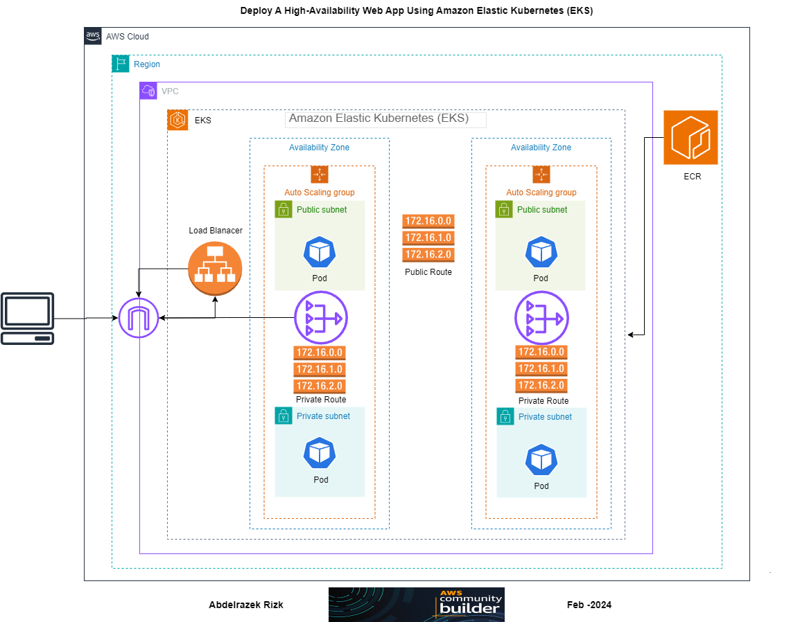

# Developing and Deploying a Basic Web Application on Amazon EKS

**Architecture Diagram:**



This is a guide on how to Developing and Deploying a Basic Web Application on Amazon EKS <br>
## Learning Objectives:

* Gain hands-on experience with containerization using **Docker**.<br>
* Understand how to use **Amazon ECR** to store and manage **container images**.<br>
* Learn the basics of creating and managing an **Amazon EKS cluster**.<br>
* Explore Kubernetes concepts like **Deployments**, **Services**, and **Horizontal Pod Autoscaling**.<br>
* Implement **multi-AZ** deployment to ensure **high availability**.<br>

Whether you are new to Amazon EKS or looking to level up your skills, this repository has you covered.<br>

`Note`: that Tutorial using `AIM with Administrative User`.<br>
Below are the steps to follow:

## Table of Contents
- [Step 1: Create a Flask Web Application](#step-1-create-a-flask-web-application)
- [Step 2: Create a Dockerfile](#step-2-create-a-dockerfile)
- [Step 3: Create a requirements.txt File](#step-3-create-a-requirementstxt-file)
- [Step 4: Preparing Your Environment](#step-4-preparing-your-environment)
- [Step 5: Build and Push Docker Image to Amazon ECR](#step-5-build-and-push-docker-image-to-amazon-ecr)
- [Step 6: Step 6: Create Amazon ECR Repository](#step-6-create-amazon-ecr-repository)
- [Step 7: Setup Amazon EKS Cluster Requirements](#step-7-setup-amazon-eks-cluster-requirements)
- [Step 8: Creating an Amazon EKS cluster](#step-8-creating-an-amazon-eks-cluster)
- [Step 9: Create a Node Group](#step-9-create-a-node-group)
- [Step 10: Create a Kubernetes Deployment](#step-10-create-a-kubernetes-deployment)
- [Step 11: Test The Application](#step-11-test-the-application)
- [Step 12: Cleanup](#step-12-cleanup)

## Step 1: Create a Flask Web Application.
Create a basic `Flask web application`. <br> [app.py](./app/app.py):

## Step 2: Create a Dockerfile.
Create a `Dockerfile` to containerize the Flask application.<br> [Dockerfile](./app/Dockerfile):

## Step 3: Create a requirements.txt File.
Create a `requirements.txt` file to list the Python dependencies.<br> [requirements.txt](./app/requirements.txt):

## Step 4: Preparing Your Environment.
Assuming you have an **Docker** and **Kubectl**. if not <br> Below are the steps to follow:<br>

### 4.1. Update the installed packages and package cache on your instance.

    sudo apt-get update
    apt list --upgradable
    sudo apt upgrade -y

### 4.2. Installing Docker.

    sudo apt-get install docker.io -y

- Start the Docker service.

```
sudo systemctl enable docker
```
```
sudo systemctl start docker
```

- Add the `ubuntu user` to the `docker group` so you can execute Docker commands without using `sudo`.

        sudo usermod -aG docker ubuntu

- **Log out** and **log back in** again or **restart** your **EC2** to pick up the new docker group permissions.

- Verify that the ubuntu can run Docker commands without sudo.

        docker run hello-world

- Troubleshoot Docker Engine installation.
```
permission denied while trying to connect to the Docker daemon socket
at unix:///var/run/docker.sock: Post "http://%2Fvar%2Frun%2Fdocker.sock/v1.24/containers/create":
dial unix /var/run/docker.sock: connect: permission denied.
```
- Run the follow command:
```
sudo chmod 666 /var/run/docker.sock
```
`Note`: that Tutorial using **EC2** with `ubuntu-jammy-22.04-amd64-server` Operation System<br>
        Docker version `24.0.5`, build `24.0.5-0`ubuntu1`~22.04.1` <br>
For other Operation System Follow the Official Docker Documunts [here](https://docs.docker.com/desktop/install/linux-install/).

### Step 5: Build and Push Docker Image to Amazon ECR.

Assuming you have an `AWS account`, follow these steps:

### 5.1. Set Up the AWS CLI.
- AWS CLI install and update

        curl "https://awscli.amazonaws.com/awscli-exe-linux-x86_64.zip" -o "awscliv2.zip"
        unzip awscliv2.zip
        sudo ./aws/install

before that step you may need to install `unzip` using `sudo apt install unzip`

- Confirm the installation.

        aws --version

output: `aws-cli/2.15.13` Python/`3.11.6 `Linux/`6.2.0-1017`-aws exe/x86_64.ubuntu.22 `prompt/off`

- Configure the AWS CLI.

        aws configure

AWS Access Key ID [None]:`<your AWS Access Key ID>`<br>
AWS Secret Access Key [None]:`<your-AWS Secret Access Key>` <br>
Default region name [None]:`<your-region>`<br>
Default output format [None]:

### 5.2. Build and Run Docker Image
- Open a terminal or command prompt and navigate to the directory containing the **Dockerfile** and run the following command:

        docker build -t my-eks-web-app .

- Run the newly built image.

        docker run -p 5000:5000 my-eks-web-app

- Running Docker locally, point your browser to` http://localhost:5000/ `or `http://127.0.0.1:5000/`

### Step 6: Create Amazon ECR Repository.

* Create an **ECR repository** to store your Docker images.
* Make note of the repository URI.

### 6.1. Ensure ECR Permissions.

- Verify that your IAM user or role has the necessary permissions to access the ECR repository.<br>
 The required permissions include: <br>

`ecr:GetAuthorizationToken `<br>
`ecr:BatchCheckLayerAvailability` <br>

You can attach the `AmazonEC2ContainerRegistryPowerUser` policy to your **IAM user** or **role** to grant these permissions.

### 6.2. Log in to AWS ECR.

 ### *private Registry.*

- Authenticate a private repository.

      aws ecr get-login-password --region <your-region> | docker login --username AWS --password-stdin <aws_account_id>.dkr.ecr.<your-region>.amazonaws.com

- **Replace:**<br>
`<your-region>` with your **region**.<br>
`<aws_account_id>` with your **aws_account_id** <br>

### 6.3. Create a private repository.

        aws ecr create-repository \
                --repository-name <repository-name> \
                --region <your-region>

- **Replace:**<br>
`<repository-name>` with your **repository-name**.<br>
`<your-region>` with your **region**.<br>

### 6.4. Tag and Push Docker Image.

- Tag the image to push to your private repository.<br>
- List the images you have stored locally to identify the image to tag and push.

        docker images

- Tag the image to push to `Amazon ECR private` repository.

        docker tag <image-name:tag> <aws_account_id>.dkr.ecr.<your-region>.amazonaws.com/<repository-name:tag>

- Push the image.

        docker push <aws_account_id>.dkr.ecr.<your-region>.amazonaws.com/<repository-name:tag>

- **Replace:**<br>
`<image-name:tag>` with your **image-name:tag** `ex: hello-world:latest`<br>
`<aws_account_id>` with your **aws_account_id**.<br>
`<your-region>` with your **region**.<br>
`<repository-name>` with your **repository-name**.<br>
`Note`: ECR repository URI= `<aws_account_id>.dkr.ecr.<your-region>.amazonaws.com/<repository-name:tag>`

Follow the Official Documunts Amazon Quick start: Publishing to `Amazon ECR Pprivate repository` using the AWS CLI [here](https://docs.aws.amazon.com/AmazonECR/latest/userguide/getting-started-cli.html).

  ### *Public Registry.*

- Authenticate a public repository.

        aws ecr-public get-login-password --region <your-region> | docker login --username AWS --password-stdin public.ecr.aws

- Create a public repository.
- Open a terminal or command prompt and navigate to the ECR directory and run the following command:.

        aws ecr-public create-repository \
             --repository-name <repository-name> \
             --catalog-data file://repositorycatalogdata.json \
             --region <your-region>

- **Replace:**<br>
`<repository-name>` with your **repository-name**.<br>
`<your-region>` with your **region**.<br>

- Tag and Push an image to `Amazon ECR Public`repository. <br>
List the images you have stored locally to identify the image to tag and push.

        docker images

- Tag the image to push to your repository with your `public repository URI` <br>
which was in the response to the `create-repository` call you made in the previous step.

        docker tag <image-name:tag> public.ecr.aws/registry_alias/<repository-name>

- Push the image to the Amazon ECR.

        docker push public.ecr.aws/registry_alias/<repository-name>

- Pull the image from the Amazon ECR.

        docker pull public.ecr.aws/g7p1j8g3/hello-flask:v.1

- **Replace:**<br>
`<registry_alias>` with your **registry_alias**.<br>
`<repository-name>` with your **repository-name**.<br>

Follow the Official Amazon Quick start: Publishing to `Amazon ECR Public` using the AWS CLI [here](https://docs.aws.amazon.com/AmazonECR/latest/public/getting-started-cli.html).

## Step 7: Set Up Amazon EKS Cluster.
- Follow the official Documunts `Amazon EKS Getting Started guide` to create an Amazon EKS cluster.
- Download the kubectl binary for your cluster's Kubernetes version from Amazon S3.
- Kubernetes 1.29

        curl -O https://s3.us-west-2.amazonaws.com/amazon-eks/1.29.0/2024-01-04/bin/linux/amd64/kubectl

- Apply execute permissions to the binary.

        chmod +x ./kubectl

- Copy the binary to a folder in your PATH.

        mkdir -p $HOME/bin && cp ./kubectl $HOME/bin/kubectl && export PATH=$HOME/bin:$PATH

-Verify EKS Version.

        kubectl version --client

## Step 7: Setup Amazon EKS Cluster Requirements.

### 7.1. Create an Amazon IAM Policy Role.

- Create IAM Policy Role.
- Create a cluster IAM role and attach the required `Amazon EKS IAM managed policy` to it.
- Open a terminal or command prompt and navigate to the **EKS directory** and run the following command:.

        aws iam create-role \
            --role-name <Policy-Role-Name> \
            --assume-role-policy-document file://"eks-cluster-role-trust-policy.json"

- Attach Policy Role.
- Attach the required Amazon EKS managed IAM policy to the role.

        aws iam attach-role-policy \
            --policy-arn arn:aws:iam::aws:policy/AmazonEKSClusterPolicy \
            --role-name EKS-Cluster-trust-policy-role

### 7.2. Create an Amazon VPC.
- Create an Amazon VPC with public and private subnets that meets Amazon EKS requirements.
- Open a terminal or command prompt and navigate to the **cloudformation directory** and run the following command:.

        aws cloudformation create-stack \
            --region <your-region> \
            --stack-name <stack-name> \
            --template-body file://amazon-eks-vpc-private-subnets.yaml

- **Replace:**<br>
`<your-region>` with your **region**.<br>
`<stack-name>` with your **stack-name**.<br>

- Navigate to the `cloud-formation outputs` Make note and write down:<br>
            - Subnets IDs in the **VPC** `<PrivateSubnet01>, <PrivateSubnet02>, <PublicSubnet01>, <PublicSubnet02>`<br>
            - **SecurityGroups** `<Security group>`

## Step 8: Creating an Amazon EKS cluster.

### 8.1.Create-cluster

        aws eks create-cluster --region <your-region> --name <cluster-name> --kubernetes-version 1.29 \
           --role-arn arn:aws:iam::<aws_account_id>:role/myAmazonEKSClusterRole \
           --resources-vpc-config subnetIds=<PrivateSubnet01>,<PrivateSubnet02>,<PublicSubnet01>,<PublicSubnet02>,securityGroupIds=<Security-group>

- **Replace:**<br>
`<your-region>` with your **region**.<br>
`<cluster-name>` with your **cluster name**. <br>
`<aws_account_id>` with your **aws_account_id**.<br>
`<PrivateSubnet01>`,`<PrivateSubnet02>`,`<PublicSubnet01>`,`<PublicSubnet02>` with your **public** and **private** subnets from `cloud-formation outputs`.<br>
`<Security-group>` with your **Security group**

 ### 8.2. Configure your computer to communicate with your cluster.

        aws eks update-kubeconfig --region <your-region> --name <cluster-name>

 ### 8.3. Confirm communication with your cluster by running the following command.

        kubectl get svc

## Step 9: Create a Node Group.

### 9.1 Create a Node AIM Policy Role.

- Create a node IAM role and attach the required Amazon Node IAM managed policy to it.
- Open a terminal or command prompt and navigate to the `EKS directory` and run the following command:.

        aws iam create-role \
            --role-name AmazonEKSNodeRole \
            --assume-role-policy-document file://"node-role-trust-relationship.json"

- Attach Policy Role.
- Attach the required `Amazon EKS Worker Node` `Amazon and EC2 Container Registry ReadOnly` Policy to the role.

```
aws iam attach-role-policy \
    --policy-arn arn:aws:iam::aws:policy/AmazonEKSWorkerNodePolicy \
    --role-name AmazonEKSNodeRole
```
```
aws iam attach-role-policy \
    --policy-arn arn:aws:iam::aws:policy/AmazonEC2ContainerRegistryReadOnly \
    --role-name AmazonEKSNodeRole
```
- Determine the IP family of your cluster.

        aws eks describe-cluster --name my-cluster | grep ipFamily

depending on which IP family you created your cluster **IPv4** or **IPv6**.
- **IPv4**

        aws iam attach-role-policy \
          --policy-arn arn:aws:iam::aws:policy/AmazonEKS_CNI_Policy \
          --role-name AmazonEKSNodeRole

 Follow the Official Documunts `Amazon EKS node IAM role` using the AWS CLI [here](https://docs.aws.amazon.com/eks/latest/userguide/create-node-role.html)

### 9.2 Create a Node Group.

- Provision compute capacity for your cluster by adding a Managed node group.

        aws eks create-nodegroup \
            --cluster-name <cluster-name> \
            --nodegroup-name <nodegroup-name> \
            --scaling-config desiredSize=(integer),minSize=(integer),maxSize=3 \
            --subnets <PrivateSubnet01> <PrivateSubnet02> <PublicSubnet01> <PublicSubnet02> \
            --instance-types t2.micro \
            --disk-size 8 \
            --ami-type AL2_x86_64 \
            --node-role arn:aws:iam::<aws_account_id>:role/<nodegroup-role>

- **Replace:**<br>
`<cluster-name>` with your **cluster name**. <br>
`<nodegroup-name>` with your **nodegroup-name**.<br>
`<desiredSize>` with The **current number** of nodes that the managed node group should **maintain** should not be `higher than` the **maxSize**. <br>
`<minSize>` with The **minimum number** of nodes that the managed node group can **scale in** to. <br>
`<maxSize>` with The **maximum number** of nodes that the managed node group can **scale out** to. <br>
`<subnets>` with your **subnetIds** to use for the **Auto Scaling group** that was created for your **node group** from previous step **Create an Amazon VPC**. <br>
`<instance-types>` with the **instance types** for a **node group**. <br>
`<aws_account_id>` with your **aws_account_id**.<br>
`<nodegroup-role>` with your **AmazonEKSNodeRole** AIM Role from previous step **Create a Node AIM Policy Role**.


## Step 10: Create a Kubernetes Deployment.

 ### 10.1. Create a Kubernetes deployment file.<br> [deployment.yaml](./deployment.yaml):<br>

- **Replace:**<br>
`<your-ecr-repository-uri>` with your **ECR repository URI**.

 ### 10.2. Apply the Deployment.
- Apply the Kubernetes Deployment:

         kubectl apply -f deployment.yaml

## Step 11: Test the Application.

Wait for the LoadBalancer service to be assigned an external IP address:

- Obtain the Load Balancer URL:
```
kubectl get svc my-eks-web-app -w
```
- output
```
NAME             TYPE           CLUSTER-IP      EXTERNAL-IP                                                               PORT(S)        AGE
my-eks-web-app   LoadBalancer   10.100.190.72   a47bd5cd4514f4f1428151bbd6f3446c-4482297959.us-west-1.elb.amazonaws.com   80:30606/TCP   2d4h
```
Once the external IP is available, you can access your web application in a browser using that IP.

## Step 12: Cleanup.
- Cleaning up your resources is an important part of managing your cloud environment. <br>
- By following these steps, you can ensure that your resources are always **clean** and **tidy** and it will also help you to **avoid unnecessary costs**.

### 12.1. Kubernetes Deployment:
```
kubectl delete deployment <deployment-name>
```
- **Replace:**<br>
`<deployment-name>` with your **deployment-name**. <br>

### 12.2. Kubernetes Services:

#### 12.2.1 List all services running in your cluster.
```
kubectl get svc --all-namespaces
```
#### 12.2.2 Delete any services that have an associated EXTERNAL-IP value.
- These services are fronted by an Elastic Load Balancing load balancer,<br> and you must delete them in Kubernetes to allow the load balancer and associated resources to be properly released.
```
kubectl delete svc <service-name>
```
- **Replace:**<br>
`<service-name>` with your **service-name**. <br>

### 12.3. Amazon Node Group:
```
aws eks delete-nodegroup \
  --cluster-name <cluster-name> \
  --nodegroup-name <nodegroup-name> \
  --region <your-region>
```
- **Replace:**<br>
`<cluster-name>` with your **cluster name**. <br>
`<nodegroup-name>` with your **nodegroup-name**.<br>
`<your-region>` with your **region**.<br>

### 12.4. Amazon EKS Cluster:
```
aws eks delete-cluster \
  --name <cluster-name>
```
- **Replace:**<br>
`<cluster-name>` with your **cluster name**. <br>

### 12.5. CloudFormation Stack:
```
aws cloudformation delete-stack \
  --stack-name <stack-name>
```
- **Replace:**<br>
`<stack-name>` with your **stack-name**. <br>

### 12.6. EC2 (Stop or Terminate):

* To stop an EC2 instance:

```
aws ec2 stop-instances \
--instance-ids <instance-id>
```

* To terminate an EC2 instance:

```
aws ec2 terminate-instances \
--instance-ids <instance-id>
```
- **Replace:**<br>
`<instance-id>` with your **instance-ids**. <br>

- Remember to always follow the best practices and guidelines provided by your cloud provider to ensure a smooth and efficient cleanup process.
- Regularly reviewing and optimizing your resource utilization can not only save costs but also improve the overall performance and efficiency of your cloud infrastructure.<br>

Follow the Official Documunts `Deleting an Amazon EKS cluster` [here](https://docs.aws.amazon.com/eks/latest/userguide/delete-cluster.html)

  Keep in mind that this example is minimal and focuses on the basic steps. <br>
  In a production scenario, you would likely include more `features`, `security measures`, and `configurations`.<br>
  Additionally, you might want to explore tools like `Helm` for managing `Kubernetes manifests` more efficiently.